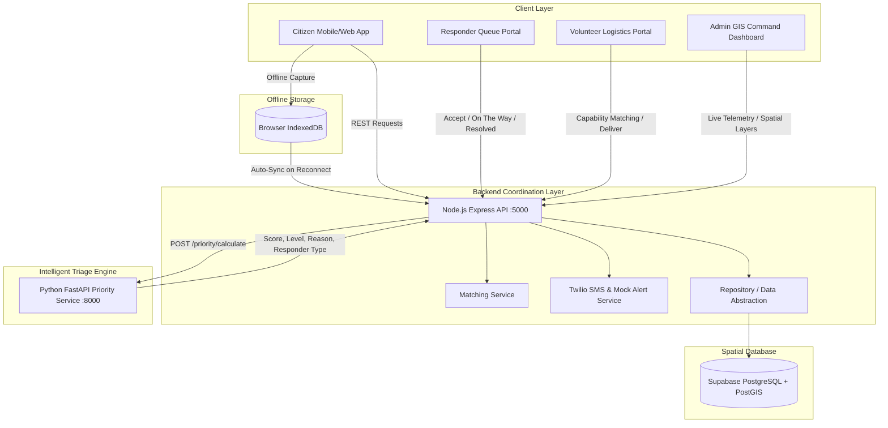

# AI-Powered Disaster Response & Relief Coordination Platform (Varahi)

> **Smart India Hackathon 2026 Working Prototype**  
> A mission-critical, community-powered disaster response and relief coordination platform combining transparent AI-assisted emergency triage, volunteer/resource matching, offline-first request capture, and a GIS-based Command Dashboard.

---

## 1. Problem Statement
During severe disasters (floods, cyclones, earthquakes, building collapses), emergency systems receive an overwhelming volume of simultaneous calls and SOS alerts. Citizens face varying degrees of urgency:
- Families trapped inside submerged houses
- Critical patients requiring immediate insulin/oxygen
- Stranded citizens needing clean drinking water and food
- Injured children needing priority evacuation

The core operational bottleneck for disaster management authorities is answering:  
**"Who needs help first? Who can help them? What specific resource is required? And where is the request located?"**

---

## 2. Core Innovation & Unique Selling Proposition (USP)
**Varahi is NOT a simple SOS app.** Simple SOS apps merely send indiscriminate alerts.  
Varahi is an **intelligent, community-powered disaster coordination ecosystem**:

1. **Transparent Rule-Based AI Priority Engine:** Automatically evaluates 8+ severity indicators (trapped status, life threat, children, elderly, injuries, medical trauma) to score requests (0–100) and generate plain-language explanations.
2. **Offline-First Request Capture:** In zero-connectivity disaster zones, citizens can log requests in local IndexedDB. When connectivity restores, requests auto-synchronize to the command center with guaranteed deduplication.
3. **Automated Volunteer & Resource Matching:** Matches citizen resource needs (food, water, medicine, first aid) against verified volunteer capabilities and Haversine proximity.
4. **Spatial GIS Command Center:** Leaflet-powered situational map with color-coded pulsing pins (Red=Critical, Orange=High, Yellow=Medium, Green=Low, Blue=Responders, Purple=Volunteers, Shelters & Hospitals).
5. **Phase 2 & 3 Architectures:** Extensible hooks for Computer Vision structural damage triage and disaster-aware safe routing.

---

## 3. System Architecture



---

## 4. Technology Stack — Strict Compliance

| Layer | Technology | Purpose |
| :--- | :--- | :--- |
| **Frontend** | React 19 + TypeScript + Vite | Responsive, accessible, mobile-first client |
| **Styling** | Vanilla CSS Design System | Custom dark-mode disaster command aesthetic |
| **Offline Storage** | IndexedDB (`idb-keyval`) | Offline-first capture, queueing, and auto-sync |
| **GIS Mapping** | Leaflet + OpenStreetMap | Interactive spatial map with custom pulsing pins |
| **Backend API** | Node.js + Express (ESM) | REST API, state management, matching, alerts |
| **Priority Engine** | Python 3.12 + FastAPI | Rule-based triage scoring & natural explanation |
| **Database** | Supabase PostgreSQL + PostGIS | Geospatial geometry, spatial indexes, Realtime |
| **Notifications** | Twilio SMS API | Automated responder dispatch SMS (with local mock) |

---

## 5. Role-Based Features

### 1. Citizen Portal (`/citizen`)
- **Emergency Rescue SOS:** People count slider, checkboxes for trapped status, children, elderly, injured, immediate life threat.
- **Relief Supplies Request:** Food, clean drinking water, medicines, first aid.
- **GPS Location Capture:** One-click device GPS capture with manual coordinates/landmark fallback.
- **Real-Time Step Tracker:** Visual lifecycle progress (`PENDING` → `PRIORITIZED` → `ASSIGNED` → `ACCEPTED` → `ON_THE_WAY` → `RESOLVED`).
- **Offline Storage Mode:** Seamless local capture with "Pending Synchronization" badge.

### 2. Responder & Police Dashboard (`/responder`)
- **Triage Queue:** Requests sorted strictly by Priority Score descending (Critical red alerts first).
- **Incident Rationale:** Clear view of why the request received that priority.
- **Operational Transitions:** Single-click "Accept Task", "Mark On The Way", and "Mark Rescued & Resolved".

### 3. Volunteer Portal (`/volunteer`)
- **Capability Profiles:** Self-select capabilities (Food, Water, Medicine, First Aid, Transport, Rescue Support).
- **Proximity Matching:** Distance calculation (km) and capability-matched request feed.
- **Delivery Completion:** Mark relief deliveries completed.

### 4. Admin Command Center (`/admin`)
- **Telemetry KPIs:** Live counts of Critical, High, Medium, Low requests, active personnel, and resolved missions.
- **Spatial GIS Map (`/admin/gis`):** Colored pins, flood inundation warning zone polygon, and relief facility layers.
- **Priority Queue & Dispatch Table:** Quick responder reassignment dropdown.
- **Emergency SMS Dispatch Log:** Audit trail of automated SMS notifications.

---

## 6. Priority Scoring Engine Algorithm

```
Emergency Base Score: 60 points
Resource Base Score:  30 points

Vulnerability & Severity Additions:
  + People Trapped:              +20 points
  + Immediate Life Threat:       +20 points
  + Medical Emergency:           +20 points
  + Injured Persons Present:     +15 points
  + Children Present:            +10 points
  + Elderly Persons Present:     +10 points
  + Multiple People (>1):        +10 points

Resource Priorities:
  + Medicine / Insulin:          +20 points
  + Drinking Water Cans:         +15 points
  + Food / Rations:              +10 points
  + First Aid Supplies:          +15 points

Score Capping: 0 to 100 points
Priority Levels:
  80 - 100 : CRITICAL (Red)
  60 - 79  : HIGH (Orange)
  40 - 59  : MEDIUM (Yellow)
  0  - 39  : LOW (Green)
```

---

## 7. Active Demo Scenario: Heavy Flooding — Bhimavaram

The platform comes pre-seeded with realistic flood disaster data for **Bhimavaram, Andhra Pradesh** (`16.5449° N, 81.5212° E`):
- **Disaster Event:** Yenamadurru Drain and Godavari canal breach causing inundation in low-lying wards.
- **Pre-seeded Requests:**
  - *Request 1 (CRITICAL - 100):* 4 family members including an 8yo child trapped on roof slab, 1 injured.
  - *Request 2 (HIGH - 70):* Diabetic senior citizen stranded needing insulin.
  - *Request 3 (MEDIUM - 55):* Family of 5 safe on terrace needing drinking water.
  - *Request 4 (MEDIUM - 40):* Stranded evacuees in municipal school needing food meal packets.
- **Pre-seeded Responders:** NDRF Rescue Unit Alpha, 1-Town Police, Mobile Medical EMS.
- **Pre-seeded Facilities:** DNR College Relief Camp, Bhimavaram Area District Hospital, 1-Town Police Station.

---

## 8. Installation & Setup

### Prerequisites
- Node.js v18+ (tested on v25.8.1)
- Python 3.10+ (tested on v3.12.0)
- npm v9+

### Repository Structure
```
/Varahi
├── /priority-engine      # Python FastAPI microservice
│   ├── main.py
│   ├── test_priority.py
│   └── requirements.txt
├── /backend              # Node.js Express REST API
│   ├── src/
│   │   ├── routes/
│   │   ├── services/
│   │   ├── store/
│   │   ├── config.js
│   │   └── server.js
│   ├── test_e2e.js
│   └── package.json
├── /frontend             # React 19 + TypeScript + Vite + Leaflet
│   ├── src/
│   │   ├── components/
│   │   ├── pages/
│   │   ├── services/
│   │   ├── types/
│   │   ├── index.css
│   │   └── App.tsx
│   └── package.json
├── /database             # PostgreSQL + PostGIS schemas
│   ├── schema.sql
│   └── seed_bhimavaram.sql
├── .env.example
└── README.md
```

---

## 9. Running Locally

### Step 1: Start Python FastAPI Priority Engine
```bash
cd priority-engine
pip install -r requirements.txt
python main.py
```
*Runs on `http://127.0.0.1:8000` (Health check: `http://127.0.0.1:8000/health`).*

### Step 2: Start Node.js Express Backend
```bash
cd backend
npm install
node src/server.js
```
*Runs on `http://127.0.0.1:5000` (Health check: `http://127.0.0.1:5000/health`).*

### Step 3: Start React Frontend
```bash
cd frontend
npm install
npm run dev -- --port 5173
```
*Open your browser at `http://localhost:5173`.*

---

## 10. Automated Testing

### 1. Test Priority Engine (Pytest)
```bash
cd priority-engine
pytest test_priority.py -v
```
*Validates 7 unit test scenarios including trapped combinations, medicine, water, food, and API contracts.*

### 2. Test End-to-End Acceptance Flow (Node.js)
```bash
cd backend
node test_e2e.js
```
*Runs the complete SIH hackathon acceptance scenario: Citizen emergency creation → FastAPI Priority calculation → Responder queue → Accept task → On The Way → Resolved → Telemetry update → Offline sync & deduplication.*

---

## 11. Environment Variables (`.env.example`)

```env
PORT=5000
NODE_ENV=development
FASTAPI_PRIORITY_URL=http://127.0.0.1:8000

# Supabase (Optional: Local in-memory repository operates out-of-the-box if omitted)
SUPABASE_URL=https://your-project.supabase.co
SUPABASE_ANON_KEY=your-anon-key
SUPABASE_SERVICE_ROLE_KEY=your-service-role-key

# Twilio SMS (Optional: Dispatches to terminal & in-app audit log if omitted)
TWILIO_ACCOUNT_SID=
TWILIO_AUTH_TOKEN=
TWILIO_PHONE_NUMBER=

VITE_API_URL=http://localhost:5000
```

---

## 12. Future Scope & Roadmap
- **Phase 2: AI Computer Vision Damage Triage:** Automatic extraction of flood watermarks, building structural collapse indications from citizen photos (`/phase2-damage`).
- **Phase 3: Disaster-Aware Dynamic Routing:** Safe route computation incorporating PostGIS flood polygons and bridge wash-out data using OSRM / OpenStreetMap (`/phase3-routing`).
- **Bluetooth / Wi-Fi Direct Mesh Synchronization:** Store-and-forward peer relays for mobile devices in isolated flood zones.
